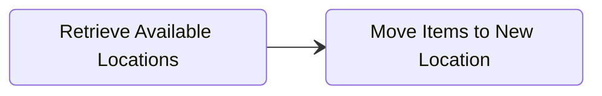

Moving a fulfillment order items to a new fulfillment location is a common order management task when items cannot be fulfilled by the currently assigned location and need to be requested with a new fulfillment location.


#### Move Fulfillment Order Flow

Moving fulfillment order items is a 2-step process:
1. Retrieve available locations for items to move using the [availableLocationsRetrieve](/docs/api/admin/reference/#/operations/availableLocationsRetrieve) endpoint.
2. Move fulfilllment order line items to a new location using the  [fulfillmentOrdersMove](/docs/api/admin/reference/#/operations/fulfillmentOrdersMove) endpoint.

:::info
Fulfillment Orders must be `"status": "open"` to be moved to a new location. If the fulfillment order you want to move is   `"status": "processing"`, use the [cancellationRequestSend](/docs/api/admin/reference/#/operations/cancellationRequestSend) endpoint to request cancellation with the current fulfillment location before moving to a new location.
:::

#### Retrieve Available Locations

Fulfillment order line items often contain products that are in stock at many locations where they could be fulfilled from. To check what locations fulfillment order items are available at, use the [availableLocationsRetrieve](/docs/api/admin/reference/#/operations/availableLocationsRetrieve) endpoint.

```json title="Retrieve Available Fulfillment Locations"
GET https://{store}.29next.store/api/admin/fulfillment-orders/{id}/available-locations/

// Example Response
{
    "available_locations": [
        {
            "id": 123,
            "name": "Example Warehouse Location",
            "fulfillment_order_line_ids": [
                7731,
                7730
            ]
        },
        {
            "id": 456,
            "name": "Another Warehouse Location",
            "fulfillment_order_line_ids": [
                7731
            ]
        }
    ]
}
```

#### Move a Fulfillment Order

Once the available locations fulfillment order line items can move, use the [fulfillmentOrdersMove](/docs/api/admin/reference/#/operations/fulfillmentOrdersMove) endpoint to move all or some of the line items.

```json title="Move Fulfillment Order Items to New Location"
POST https://{store}.29next.store/api/admin/fulfillment-orders/{id}/move/

{
  "new_location_id": 123,
  /// optional, if not passed, all lines will be moved to the new location
  "fulfillment_order_line_items": [
    {
      "id": 7711
    }
  ]
}
```
