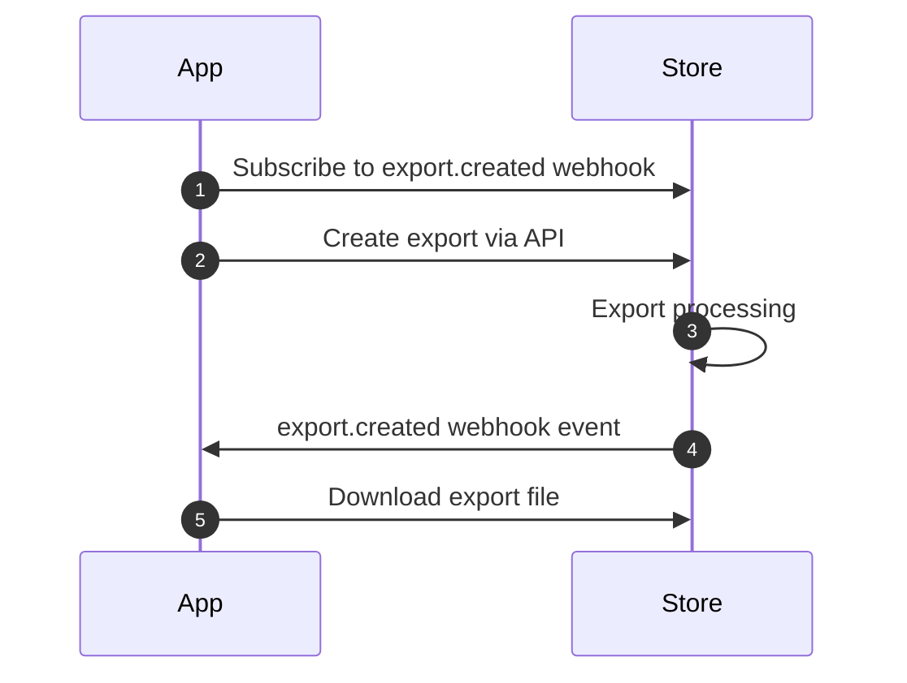

import { Callout } from 'fumadocs-ui/components/callout';

The Exports API allows you to generate and download bulk data exports from your store as CSV files. This is useful for reporting, analytics, reconciliation, and data migration workflows.

<Callout type="info">
Exports are processed asynchronously. After creating an export, you'll need to poll for completion before downloading the file.
</Callout>

### Export Flow



Creating and downloading an export is a 3-step process:

1. Subscribe to the `export.created` [webhook event](/docs/webhooks) to be notified when exports are ready.
2. Create a new export using the [exportsCreate](/docs/admin-api/reference/exports/exportsCreate) endpoint with your desired type and date range.
3. When you receive the `export.created` webhook, download the file using the [exportsDownloadRetrieve](/docs/admin-api/reference/exports/exportsDownloadRetrieve) endpoint.

### Available Export Types

Use the [exportsTypesRetrieve](/docs/admin-api/reference/exports/exportsTypesRetrieve) endpoint to list all available export types, or reference the table below.

| Type | Description |
| ---- | ----------- |
| `order_list` | Orders |
| `order_line_items` | Order Line Items |
| `customer_list` | Customers |
| `transaction_list` | Transactions |
| `dispute_list` | Disputes |
| `subscription_list` | Subscriptions |
| `subscription_line_items` | Subscription Line Items |
| `open_cart_list` | Open Carts |
| `open_cart_line_items` | Open Cart Line Items |
| `return_list` | Returns |
| `return_line_items` | Return Line Items |
| `fulfillment_list` | Fulfillments |
| `fulfillment_line_items` | Fulfillment Line Items |

### Create an Export

To create a new export, send a POST request to the [exportsCreate](/docs/admin-api/reference/exports/exportsCreate) endpoint with the export `type` and date range.

```json title="Create Export Request" http-method="POST" http-target="https://{store}.29next.store/api/admin/exports/"
{
  "type": "order_list", // export type
  "date_from": "2025-01-01T00:00:00Z", // start of date range
  "date_to": "2025-03-31T23:59:59Z" // end of date range
}
```

The response returns the export object with a `pending` status.

```json title="Create Export Response"
{
  "id": 42,
  "created_at": "2025-04-01T12:00:00Z",
  "type": "order_list",
  "status": "pending",
  "date_from": "2025-01-01T00:00:00Z",
  "date_to": "2025-03-31T23:59:59Z",
  "url": "https://{store}.29next.store/api/admin/exports/42/"
}
```

### Poll Export Status

After creating an export, poll the [exportsRetrieve](/docs/admin-api/reference/exports/exportsRetrieve) endpoint until the `status` changes from `pending` to `available`.

```json title="Retrieve Export Status" http-method="GET" http-target="https://{store}.29next.store/api/admin/exports/{id}/"
{
  "id": 42,
  "created_at": "2025-04-01T12:00:00Z",
  "type": "order_list",
  "status": "available", // export is ready to download
  "date_from": "2025-01-01T00:00:00Z",
  "date_to": "2025-03-31T23:59:59Z",
  "url": "https://{store}.29next.store/api/admin/exports/42/"
}
```

<Callout type="warn">
Avoid polling too frequently. Checking every couple of minutes is sufficient for pending exports. For a more efficient approach, subscribe to the `export.created` [webhook event](/docs/webhooks) to be notified immediately when an export is available for download.
</Callout>

### Download Export File

Once the export status is `available`, use the [exportsDownloadRetrieve](/docs/admin-api/reference/exports/exportsDownloadRetrieve) endpoint to get a download URL for the CSV file.

```json title="Download Export" http-method="GET" http-target="https://{store}.29next.store/api/admin/exports/{id}/download/"
{
  "url": "https://example.com/media/{store}/export_csv/{file_name}.csv?signature" // signed download
}
```

<Callout type="warn">
Download URLs are temporary signed URLs. Fetch the file promptly after retrieving the URL. If the URL expires, request a new one from the download endpoint.
</Callout>

### Export Webhooks

Subscribe to the `export.created` [webhook event](/docs/webhooks) to be notified immediately when an export is available for download. The webhook payload includes the export object data, allowing you to proceed directly to downloading the file without additional API calls.

<Callout type="idea">
Using the `export.created` webhook is the recommended approach for automated export workflows. It eliminates the need for polling and ensures you download the file as soon as it's ready.
</Callout>


### List Exports

Use the [exportsList](/docs/admin-api/reference/exports/exportsList) endpoint to retrieve previous exports with optional filtering by type and creation date.

```json title="List Exports" http-method="GET" http-target="https://{store}.29next.store/api/admin/exports/"
{
  "next": null,
  "previous": null,
  "results": [
    {
      "id": 42,
      "created_at": "2025-04-01T12:00:00Z",
      "type": "order_list",
      "status": "available",
      "date_from": "2025-01-01T00:00:00Z",
      "date_to": "2025-03-31T23:59:59Z",
      "url": "https://{store}.29next.store/api/admin/exports/42/"
    }
  ]
}
```

<Callout type="info">
The list endpoint uses cursor-based pagination. Use the `next` and `previous` URLs in the response to navigate through results.
</Callout>
