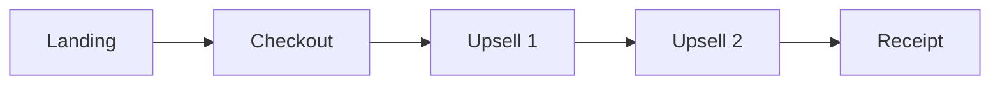
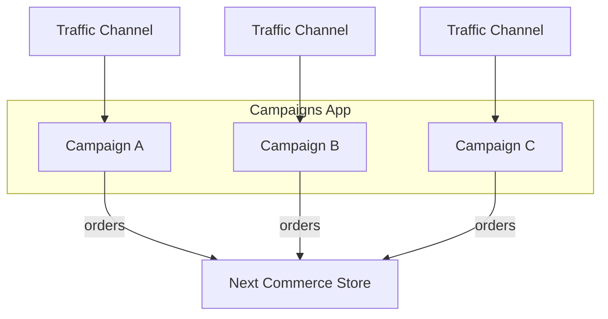

# Introduction to Campaigns

Campaigns enable developers to build fully custom external checkout experiences using HTML and JavaScript — **no backend server-side integration required**. Each campaign is backed by a headless, CORS-enabled API that handles products, pricing, payments, and order creation.

You can create multiple campaigns for different product offers, markets, and A/B testing, each with its own set of packages, offers, and shipping options.

## Core Concepts

### Campaigns

A **campaign** is the top-level configuration that ties together everything needed for an external checkout flow:

- **Packages** — what products are being sold, at what quantities and prices
- **Offers** — discounts that apply automatically or via voucher codes
- **Shipping Options** — available shipping methods and prices
- **Payment Methods** — which payment methods customers can use
- **Currency & Language** — localization settings for the checkout

Each campaign has a unique **API Key** used to authenticate all API requests. Campaigns are created and managed in the Next Commerce dashboard via the **Campaigns App**.

### Packages

A **package** is a virtual link to a **product variant** (SKU) in your store catalog with a custom quantity and custom pricing. Packages are what customers actually purchase in a campaign — they let you create different purchasing options for the same product without changing the product itself.

For example, a single product could have multiple packages offering different quantities at different price points:

- **1x Widget** — 1 unit at $10.00
- **3x Widget Bundle** — 3 units at $7.00 each ($21.00 total)
- **5x Widget Best Value** — 5 units at $6.00 each ($30.00 total)

Packages can also be configured as **recurring** for subscription products, with a custom interval (e.g. every 30 days).

### Offers

**Offers** control pricing discounts based on how many packages a customer adds to their order. Packages in an order can be any mix of variants — for example, 1 white and 1 black of the same product both count toward the offer condition.

For example, a campaign selling t-shirts might have offers like:

- **Buy 1 package** — regular price
- **Buy 2 packages** — 10% off (any mix of packages allowed on the offer)
- **Buy 3 packages** — 20% off (any mix of packages allowed on the offer)

There are two types of offers:

- **Offer** — automatically applies when the order meets the condition
- **Code** — only applies when the code is applied to the order

Offers can also be stacked — for example, an automatic quantity discount and a voucher code can both apply to the same order. When offers apply, the API returns adjusted before/after pricing so you can display savings to the customer.

### Typical Campaign Flow

A campaign funnel guides customers through a series of pages, each backed by the Campaigns API:

- **Landing** — Marketing page that drives traffic to the campaign
- **Checkout** — Customer selects package, enters shipping, billing, and payment details
- **Upsells** — Post-purchase offers to increase order value
- **Receipt** — Order confirmation with details

Session tracking is available to monitor performance across all these steps — page views, cart creation, orders, and upsells all flow into real-time campaign performance reports.

<Callout type="info">

This is a simplified example of a campaign flow. You can customize the flow to meet your specific needs.

</Callout>
### How It All Fits Together

Each campaign is an isolated sales channel with its own packages, offers, and checkout flow. Traffic sources drive customers into campaign funnels, and all resulting orders flow into the merchant's Next Commerce store.

## Getting Started

### 1. Create a Campaign

In the Next Commerce dashboard, install the **Campaigns App** and create a new campaign. Add packages mapped to products in your store.

### 2. Get Your API Key

Each campaign has a unique API key found on the campaign's **Integration** tab. This key authenticates all API requests.

### 3. Integration Options

There are two ways to build your campaign frontend:

| Approach | Best For | Description |
| --- | --- | --- |
| [**Campaign Cart SDK**](/docs/campaigns/campaign-cart/) | Fastest development | An attribute-driven HTML/JS SDK. Build cart, checkout, and upsell flows using `data-next-*` attributes — no custom JavaScript required. |
| [**Campaigns API**](/docs/campaigns/api/) | Full control | A headless REST API for developers who want complete control over the checkout experience with custom JavaScript. |

<Callout type="idea" title="Starter Template">
The fastest way to get started is with the [Campaign Cart Starter Template](https://github.com/NextCommerceCo/campaign-cart-example) — a ready-to-use campaign flow with landing page, checkout, upsell, and receipt pages pre-configured.
</Callout>