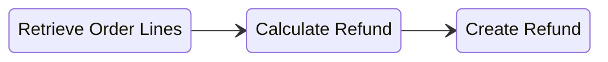
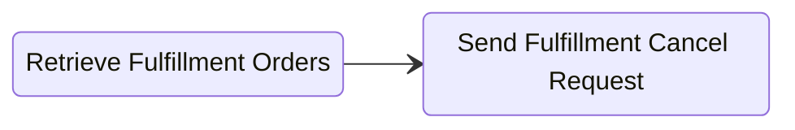

Order management operations can be automated through the Admin API for more efficient operations and bulk actions on large quanities of orders.

Below are best practices and guides for common scenarios merchants and partners use to manage orders on the Admin API.

### Order Refunds

Order management actions that require refunding and removing items from an order can be done through the refund flow. The refund flow is espcially useful when creating partial refunds or creating refunds for items that have already shipped to the customer.

#### Refund Flow


Refunding specific items of an order is a 3-step process:
1. Retreive order line items using the [ordersRetrieve](/docs/api/admin/reference/?v=2024-04-01#/operations/ordersRetrieve) endpoint.
2. Calculate the refund using the [ordersRefundCalculateCreate](/docs/api/admin/reference/?v=2024-04-01#/operations/ordersRefundCalculateCreate) endpoint.
3. Create the refund using the [ordersRefundCreate](/docs/api/admin/reference/?v=2024-04-01#/operations/ordersRefundCreate) endpoint.


:::info
Order Refund Calculate APIs are only available on `2024-04-01` version and newer. See [API Versioning](/docs/api/admin/#versioning) for how to specify a version in your requests.
:::

#### Retreieve Order Lines

Below is an abreviated example request to [ordersRetrieve](/docs/api/admin/reference/?v=2024-04-01#/operations/ordersRetrieve) endpoint to get the line items of the order.

```json title="Retrieve Order Details"
// GET https://{store}.29next.store/api/admin/orders/{number}/
{
  "lines": [
    {
      "id": 1000, // order line item
      "quantity": 3, // quantity in the order
      "current_quantity": 3 // quantity available and not yet removed from the order
    }
  ]
}
```
:::caution Order Payments Must Be Captured
Order payments must be captured in order to create partial refunds, uncaptured payments cannot be partially refunded.
:::

#### Calculate Refund

Call the [ordersRefundCalculateCreate](/docs/api/admin/reference/?v=2024-04-01#/operations/ordersRefundCalculateCreate) endpoint with your line items to calculate the refund and see which initial payment transactions will be refunded.

```json title="Refund Calculate Request"
// POST https://{store}.29next.store/api/admin/orders/{number}/refund/calculate/
{
  "refund_lines": [
    {
      "line_id": 1000, // line item we want to refund
      "quantity": 1 // quantity to refund
    }
  ],
  "refund_shipping": {
    "full_refund": false, // set true to fully refund shipping
    "amount_excl_tax": "3.99"
  }
}
```
Below is the response from the [ordersRefundCalculateCreate](/docs/api/admin/reference/?v=2024-04-01#/operations/ordersRefundCalculateCreate)  API that has been slightly abbreviated to focus on the relevant refund items.

```json title="Refund Calculate Response"
{
  "refund_lines": [
    {
      "line_id": 1000, // line item being refunded
      "quantity": 1, // number of items being refunded
      "restock_type": "no_restock", // restock action, see notes
      "refundable_quantity": 1, // items that can be refunded
      "amount_excl_tax": "59.99", // amount to be refunded excl tax
      "amount_incl_tax": "59.99", // amount to be refunded incl tax
      "total_tax": "0.00" // total tax on this line item to refund
    }
  ],
  "refund_shipping": {
    "amount_incl_tax": "3.99", // amount to be refunded incl tax
    "amount_excl_tax": "3.99", // amount to be refunded excl tax
    "total_tax": "0.00", // shipping tax to be refunded
    "refundable_amount": "4.99" // shipping amount avialable to refund
  },
  "transactions": [
    {
      "id": 1000, // transaction the refund will be allocated to, can be multiple.
      "amount": "63.98", // amount being refunded on this transaction
      "refundable_amount": "184.96" // amount available to refund with this transaction
    }
  ],
  "amount_excl_tax": "63.98", // total amoutn excl tax being refunded
  "amount_incl_tax": "63.98", // total amount incl to be refunded
  "total_tax": "0.00", // total tax being refunded
  "currency": "USD"
}
```


#### Create Refund

We're now ready to create a refund using the [ordersRefundCreate](/docs/api/admin/reference/?v=2024-04-01#/operations/ordersRefundCreate) endpoint, see request details below.

```json title="Order Create Refund Request"
// POST https://{store}.29next.store/api/admin/orders/{number}/refund/
{
  "note": "Example reason for the refund",
  "refund_lines": [
    {
      "line_id": 1000, // line item being refunded
      "quantity": 1, // number of items being refunded
      "restock_type": "no_restock", // restock action (from calculate step)
    }
  ],
  "refund_shipping": {
    "amount_excl_tax": "3.99",
    "full_refund": false
  },
  "send_refund_notification": true, // send refund email notification to customer
  "transactions": [
    {
      "id": 1000,  // transaction id to refund (from calculate step)
      "amount": "63.98" // amount to refund to this transaction (from calculate step)
    }
  ]
}
```
:::info Restock Actions
Depending on the product type and status of the line items being refunded, there are differen't restock actions available.

**Physical Product**
- If unfulfilled, restock_type must be `cancel`.
- If fullfilled, restock_type can be `return` or `no_restock`.

**Digital Product**
- If unfulfilled, restock_type must be `cancel`.
- If fulfilled, restock_type must be `no_restock`.
:::


### Update Shipping Address

Updating an order shipping address is a common task that can be done with a PATCH request to the [ordersUpdate](/docs/api/admin/reference/#/operations/ordersUpdate) endpoint.


```json title="Update Order Shipping Address"
// PATCH https://{store}.29next.store/api/admin/orders/{number}/
{
  "shipping_address": {
    "line1": "4765 Test Lane West", // new shipping adddress line 1
    "line4": "Mountain Pass", // new shipping address city
    "state": "CA", // new shipping address state
    "postcode": "92366", // new shipping address postcode
    "country": "US" // new shipping address country
  }
}
```
:::info Before Fulfillment Processing

Updating an order shipping address should be done **before** the order is sent to a fulfillment location for fulfillment. If the order has already been accepted and processing, send a a [cancellationRequestSend](/docs/api/admin/reference/#/operations/cancellationRequestSend) request and then [fulfillmentRequestSend](/docs/api/admin/reference/#/operations/fulfillmentRequestSend) after you've updated the shipping address. 
:::


### Request Fulfillment

Fulfillment can be requested immediately through the [fulfillmentRequestSend](/docs/api/admin/reference/#/operations/fulfillmentRequestSend) for cases that you'd like to immediately send the fulfillment order to the fulfillment location for fulfillment. 


```json title="Fulfillment Request"
// POST https://{store}.29next.store/api/admin/fulfillment-orders/{id}/fulfillment-request/

{
  "fulfillment_order_line_items": [  // will split the fulfillment order into a new fulfillment order
    {
      "id": 0,
      "quantity": 1
    }
  ],
  "message": "Special message to warehouse", // message to the fulfillment location
  "notify": true // notify the customer when fulfillment order is fulfilled
}
```

### Hold Fulfillment

Holding fulfillment for an order while waiting for additional review or making adments to the order before sending to the fulfillment location for shipping.


1. Retrieve all fulfillment Orders using the [ordersFulfillmentOrdersRetrieve](/docs/api/admin/reference/#/operations/ordersFulfillmentOrdersRetrieve) endpoint.
2. Send a [fulfillmentOrdersHold](/docs/api/admin/reference/#/operations/fulfillmentOrdersHold) request for each fulfillment order to hold.

```json title="Hold Fulfillment Order Request"
// POST https://{store}.29next.store/api/admin/fulfillment-orders/{id}/hold/
{
  "reason": "address_incorrect", // see available reasons in api reference
  "reason_message": "Additional relevant detail." // provide additional relevant detail
}
```

### Cancel Fulfillment

Canceling a fulfillment order that is already accepted and processing with a fuflillment location is a common order management task to stop fulfillment or as a prerequisite step to moving a fulfillment order to a new location. 


1. Retrieve all fulfillment Orders using the [ordersFulfillmentOrdersRetrieve](/docs/api/admin/reference/#/operations/ordersFulfillmentOrdersRetrieve) endpoint.
2. Send a [cancellationRequestSend](/docs/api/admin/reference/#/operations/cancellationRequestSend) request for each fulfillment order to request fulfillment cancellation.


```json titl="Fulfillment Order Cancellation Request"
// POST https://{store}.29next.store/api/admin/fulfillment-orders/{id}/cancellation-request/
{
  "message": "Reason why canceling fulfillment" // message sent to the fulfillment location regarding the cancellation
}
```

### Move Fulfillment Orders

```mdx-code-block

import MoveFulfillmentOrders from '@site/_snippets/_moving-fulfillment-orders.mdx';

<MoveFulfillmentOrders />
```

### Cancel Order

Canceling an order is a common order management task when you need to cancel the entire order and refund all payment transactions. To cancel an order, send a request to the [ordersCancelCreate](/docs/api/admin/reference/?v=2024-04-01#/operations/ordersCancelCreate) endpoint. 

```json title="Cacenl Order Request"
// POST https://{store}.29next.store/api/admin/orders/{number}/cancel/
{
  "cancel_reason": "Customer wants to cancel", // Appropiate cancel reason message
  "full_refund": true, // Refund all remainaing payments or not
  "send_cancel_notification": true // Send the customer a notification or not
}
```


