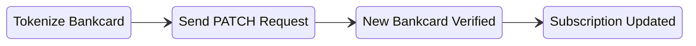

Subscriptions management can be done through Admin API to automate business processes and perform bulk operations.

:::info
Subscription management actions most often times will only affect future renewals orders/charges of the subscription.
:::

### Create Subscription

Subscriptions can be created directly through the [subscriptionsCreate](/docs/api/admin/reference/#/operations/subscriptionsCreate) Admin API endpoint for scenarios such as custom order flows or importing subcriptions from another platform.

```json title="Create Subscription"
{
    "lines": [ // subscription line item products and pricing
        {
            "product_id": 123,
            "quantity": 1,
            "currency": "USD",
            "price": "19.99"
        }
    ],
    "shipping_code": "default-shipping", // shipping method for renewal orders
    "shipping_price": "3.99", // shipping price for renewal orders
    "interval": "day", // subscription renewal interval
    "interval_count": 30, // subscription renewal interval count
    "next_renewal_date": "2022-2-28T08:41:37+07:00", // first renewal date
    "user": {
        "email": "john@smiths.com", // get or create a customer based on email address
        "first_name": "Alex",
        "last_name": "Test"
    },
    "use_default_billing_address": true, // alternatively pass full billing_address
    "use_default_shipping_address": true, // alternatively pass full shipping_address
    "payment_method": "card_token",
    "payment_details": {
        "card_token": "<Card Token>" //
    },
}
```

### Updating Products & Pricing

Updating a subscription recurring price can be done through [subscriptionLinesCreate](/docs/api/admin/reference/#/operations/subscriptionsLinesCreate) and [subscriptionLinesUpdate](/docs/api/admin/reference/#/operations/subscriptionsLinesUpdate) API endpoints.

**Adding an Additional Product**

To add a new product to a subscription, use the [subscriptionLinesCreate](/docs/api/admin/reference/#/operations/subscriptionsLinesCreate) Admin API endpoint with the product, price, and quanity details.

```json title="Adding an Additional Product"
// POST https://{store}.29next.store/api/admin/subscriptions/{id}/lines/

{
  "price": "9.99", // recurring price for the product
  "product_id": 100, // product ID
  "quantity": 1 // quantity of the product
}
```

**Updating an Existing Product Price**

To update and existing product price and quantity on a subscription line, use the [subscriptionsLinesUpdate](/docs/api/admin/reference/#/operations/subscriptionsLinesUpdate) Admin API endpoint with the new price, and new quanity details.

```json title="Updating an Existing Product"
// PUT https://{store}.29next.store/api/admin/subscriptions/{id}/lines/{lineId}/

{
  "price": "9.99", // new recurring price for the product
  "product_id": 100, // new product ID
  "quantity": 1 // new quantity of the product
}
```

**Removing a Product**

To remove a product from a subscription, use the [subscriptionsLinesDestroy](/docs/api/admin/reference/#/operations/subscriptionsLinesDestroy) endpoint to remove the line item (ie the product) from future renewal orders from the subscription.

```json title="Remove an Existing Product"
// DELETE https://{store}.29next.store/api/admin/subscriptions/{id}/lines/{lineId}/
```

:::caution
Subscriptions must have at least one line item with a product, you can alternatively cancel the subscription to stop all future renewals.
:::

### Updating Renewal Schedule

Changing the rewnal schedule of a subscription can be achived with a PATCH request to the [subscriptionsPartialUpdate](/docs/api/admin/reference/#/operations/subscriptionsPartialUpdate) endpoint with a new `interval` and `interval_count`, ie 30 days.

```json title="Update Subscription Renewal Schedule"
// PATCH https://{store}.29next.store/api/admin/subscriptions/{id}/
{
    "interval": "day",
    "interval_count": 30,
    "next_renewal_date": "2025-06-29T03:28:59.193252-05:00" // optional next renewal date
}
```

### Changing Next Renewal Date

Changing the next renewal date of a subscription can be achieved through updating the `next_renewal_date` key on the subscription object with a PATCH request to the [subscriptionsPartialUpdate](/docs/api/admin/reference/#/operations/subscriptionsPartialUpdate) endpoint with your new renewal date and time.

```json title="Update Next Renewal Date"
// PATCH https://{store}.29next.store/api/admin/subscriptions/{id}/
{
    "next_renewal_date": "2025-06-29T03:28:59.193252-05:00" // next renewal date & time
}
```

:::tip
If you would like to immediately renew the subscription, you can pass a date from the past and the subscription will process a renewal attempt within the next 30 minutes.
:::

### Updating Payment Details

Updating the Payment Gateway of a subscription can done through the [subscriptionsPartialUpdate](/docs/api/admin/reference/#/operations/subscriptionsPartialUpdate) endpoint.

**Changing Payment Gateway**

To change the payment gateway used for bankcard payments of a subscription, send a PATCH request to the [subscriptionsPartialUpdate](/docs/api/admin/reference/#/operations/subscriptionsPartialUpdate) endpoint with the new `payment_gateway`.

```json title="Update Payment Gateway"
// PATCH https://{store}.29next.store/api/admin/subscriptions/{id}/
{
    "payment_details": {
        "payment_gateway": 23 // new payment gateway to be used on the next renewal
    }
}
```

**Updating Bankcard Payment Method**

To change the bankcard on a subscription, pass a new `card_token` with a PATCH request to the [subscriptionsPartialUpdate](/docs/api/admin/reference/#/operations/subscriptionsPartialUpdate) endpoint.

:::info
To update a bankcard on a subscription, you must use the **[iFrame to tokenize](/docs/api/admin/guides/iframe-payment-form.md)** the bankcard and use the `card_token` when updating the subscription itself.

The new bankcard will be automatically verfied with a `verify` request to a payment gateway to ensure the new bankcard is valid and can be used for future renewals. If the bankcard cannot be verified, the update request will fail and return an error.
:::

**New Bankcard Payment Method Flow**


```json title="New Bankcard Payment Method"
// PATCH https://{store}.29next.store/api/admin/subscriptions/{id}/
{
    "payment_details": {
        "card_token": "<New Card Token>", // new card token
        "payment_gateway": 23 // optionally pass a specific gateway
    },
    "billing_address": {
        "country": "string", // optionally pass a new billing address
        "first_name": "John",
        "last_name": "Doe",
        "line1": "123 East West St.",
        "line4": "New York",
        "state": "NY",
        "postcode": "90210"
    }
}
```

### Retrying Renewal

Subscriptions that are `past_due` status can be attemted to retry the renewal, often combined with a new `payment_gateway`, by using the [subscriptionsRetryCreate](/docs/api/admin/reference/#/operations/subscriptionsRetryCreate) endpoint.

```json title="Retry Subscription Renewal"
// POST https://{store}.29next.store/api/admin/subscriptions/{id}/retry/

{
  "payment_gateway": 122 // optional new payment gateway to retry with
}
```

:::tip
The subscription retry endpoint is useful for custom recovery logic when attempting to recover failing subscriptions.
:::

### Canceling

To cancel a subscription, use the [subscriptionsCancelCreate](/docs/api/admin/reference/#/operations/subscriptionsCancelCreate) endpoint to stop all future renewals.


```json title="Cancel Subscription"
// https://{store}.29next.store/api/admin/subscriptions/{id}/cancel/

{
  "cancel_reason": "not_satisfied_with_product", // required
  "cancel_reason_other_message": "Wasn't happy with result", // optional
  "send_cancel_notification": true // to send the cancelation email or not
}
```

