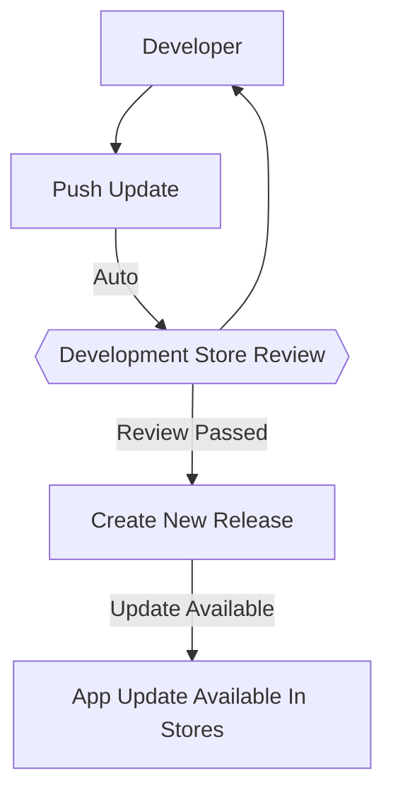

# Development Flow

Like any software, Apps require initial development and then ongoing maintenance and improvements. Below is an overview of how to manage develop and release new versions of your app after it's already been installed and live in production.

### Development Stores

App development stores are stores linked to your app for quick iterations, testing and reviewing functionality.

**App changes are automatically pushed to your development stores**

When developing your app, you'll be using App Kit to `nak build` and `nak push` your latest changes to 29 Next.  Your app will automatically updated on your development store for a quick feedback loop and reviewing your latest changes.


**App changes are not automatically pushed to existing stores with your app installed**

This is to ensure developers have a safe path add new features, test on your development store, and [create a release once](#releases) you're ready. :handshake:


:::caution
You should always test and verify your latest changes on your development store to make sure that everything is working as expected before creating a release.
:::


```mdx-code-block

import DevelopmentStore from '@site/_snippets/_offer-development-store.mdx';

<DevelopmentStore name="Development Store Offer" />

```

### Releases

Once you're confident with your app and tested it on your development store, you can create a **Release** on the App detail page in your Partner account. Releases are versioned snapshots of your App that can be installed on public stores and also trigger updates for existing installations. Store's always install the latest version of your app.

#### Versioning

App versions follow [semantic versioning](https://semver.org/) which allows app developers to create and track releases of their app. App version's should always increase to trigger an available update for stores that have already the app installed.

#### App Updates

If store already has your app installed and you create a new release, existing app installations will be able to update to the latest version.


### Development & Release Flow

Below is a diagram to highlight the workflow for creating your first app, reviewing it on your development store, and creating point releases to distribute your app to production stores.


