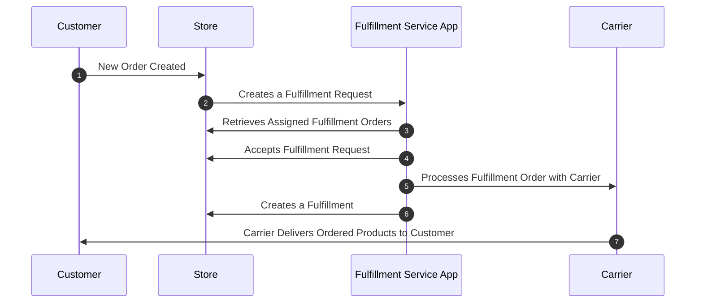
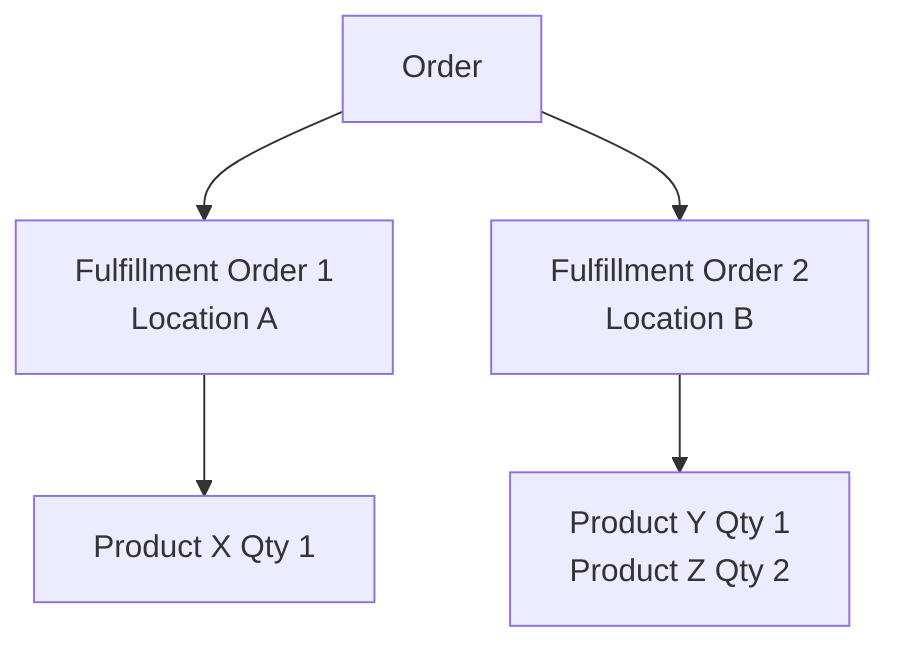
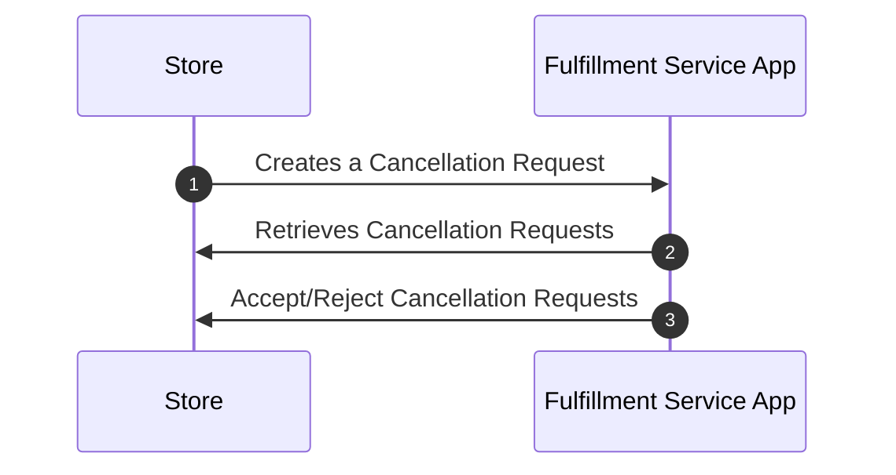
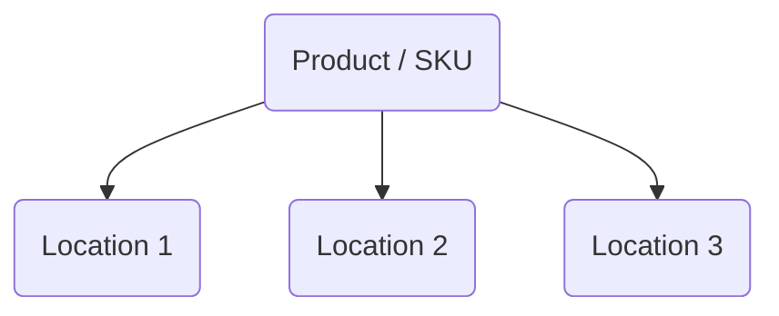

```mdx-code-block
import Tabs from '@theme/Tabs';
import TabItem from '@theme/TabItem';
import Link from '@docusaurus/Link';
```

Fulfillment service apps are integrations that manage fulfillment of physical products for merchants by enabling transparent communication between fulfillment providers and merchants using the 29 Next dashboard.


:::info
View a fully functional [Demo Fulfillment Service App](https://github.com/29next/demo-fulfillment-service-app) to see all of the concepts in action with detailed code examples.
:::


### Fulfillment Flow Overview

Below is a high-level overview of the fulfillment flow for fulfillment services to accept and process assigned fulfillment orders.



#### Fulfillment Flow Detail

#### Step 1 - New Order Created

All orders start with a customer creating a new order in the Checkout Flow, Admin API, or a recurring Subscription. Orders contain multiple [Fulfillment Orders](#fulfillment-orders), each with the products allocated to the same [Fulfillment Location](#fulfillment-locations) that has the products in stock.

#### Step 2 - Store Creates a Fulfillment Request

After a delay period (usually several hours), the store will send a fulfillment request to the [Fulfillment Location](#fulfillment-locations) assigned to the order. Fulfillment Requests can be initiated by dashboard users, background processes, or via the Admin API. See [Fulfillment Locations](#fulfillment-locations).

#### Step 3 - Fulfillment Service Retrieves Assigned Fulfillment Orders

In response to receiving a fulfillment request, the fulfillment service needs to retrieve all of their assigned fulfillment orders from the [Assigned Fulfillment Orders](/docs/api/admin/reference/#/operations/assignedFulfillmentOrdersList) API endpoint. See [Assigned Fulfillment Orders](#assigned-fulfillment-orders).

#### Step 4 - Fulfillment Service Accepts Fulfillment Request

For each assigned fulfillment order request in Step 3, the fulfillment service needs to `Accept` or `Reject` the assignment to notify the store the order is expected to be fulfilled or not. See [Accepting Fulfillment Requests](#accepting-fulfillment-requests).

#### Step 5 - Fulfillment Service Processes Fulfillment Order with Carrier

Accepted fulfillment orders are processed by the fulfillment service location to prepare shipment to the customer.

#### Step 6 - Fulfillment Service Creates a Fulfillment

Once an order has been fulfilled, the fulfillment service creates a fulfillment to upload with shipment carrier tracking information and notify the customer their order has shipped. See [Creating Fulfillments](#creating-fulfillments).

#### Step 7 - Carrier Delivers Ordered Products to Customer
The carrier is responsible for delivering the products to the customer in this stage.

### Fulfillment Orders

A Fulfillment Order represents items in an order that are to be fulfilled from the same location. A single order often contains multiple fulfillment orders, it's important to keep this in mind for your integration.



### Fulfillment Locations

Fulfillment Services need to create `Locations` which represent their warehouses where physical products are stored and fulfilled from. Product `stockrecords` must be associated with a location for fulfillment.

When new orders are created, the fulfillment orders are assigned to the locations based on [Fulfillment Routing](https://docs.29next.com/features/fulfillment-guide/location-based-routing). The Location Address is also used for Tax calculation. See the [Locations Create](/docs/api/admin/reference/#/operations/locationsCreate) endpoint to create a location.

#### Location Callback
The location `callback` is a URL the store will send `Fulfillment Request` webhooks to notify them of a new fulfillment assigned. Fulfillment Services need to query their [Assigned Fulfillment Orders](#assigned-fulfillment-orders) to retrieve the fulfillment order details.

:::caution
Fulfullment Requests are sent to the location `callback` + `/fulfillment-order-notification/`.
:::

**Fulfillment assignment request types are:**

- `fulfillment_requested` - when a new fulfillment order has been requested to be fulfilled.
- `cancellation_requested`- when an already processing fulfillment order has been requested to cancel fulfillment.

<Tabs>
<TabItem value="fulfillment_requested" label="Fulfillment Request">

```json  title="Example Fulfillment Request Payload"
{
  "type": "fulfillment_requested"
}
```
</TabItem>
<TabItem value="cancellation_requested" label="Cancellation Request">

```json  title="Example Cancellation Request Payload"
{
  "type": "cancellation_requested"
}
```

</TabItem>

</Tabs>

:::tip
The webhook request has a `X-29Next-Store` header that indicates which store the request is from if you have a global callback url.
:::


### Assigned Fulfillment Orders
The [Assigned Fulfillment Orders](/docs/api/admin/reference/#/operations/assignedFulfillmentOrdersList) will return a list of all fulfillment orders assigned to your locations. Your app is recommended to call this API in response to receiving a notification to the location callback, and you may also want to poll this endpoint occasionally (ie once per hour) to ensure you've actioned everything requested.

:::info
Use the appropriate `assignment_status` parameter to filter the fulfillment orders to those that require action.
:::

<Tabs>
<TabItem value="fulfillment_requested" label="Fulfillment Requests">

Retrieve all pending Fulfillment Requests

```json
GET https://{store}.29next.store/api/admin/assigned-fulfillment-orders/?assignment_status=fulfillment_requested
```
</TabItem>
<TabItem value="cancellation_requested" label="Cancellation Requests">

Retrieve all pending Cancellation Requests

```json
GET https://{store}.29next.store/api/admin/assigned-fulfillment-orders/?assignment_status=cancellation_requested
```

</TabItem>

</Tabs>

:::tip
Requests to the location callback indicate the request `type` that should be passed to the [Assigned Fulfillment Orders](/docs/api/admin/reference/#/operations/assignedFulfillmentOrdersList) API as the `assignment_status` querystring value to filter fulfillment orders to those for the flow.

For example, to see new fulfillment requests pending acceptance, pass `assignment_status=fulfillment_requested` to the Assigned Fulfillment Orders API, `fulfillment_requested` was passed as `type` to the callback.
:::

### Accepting Fulfillment Requests

To `Accept` a Fulfillment Request assignment, send a POST request to the [Fulfillment Request Accept](/docs/api/admin/reference/#/operations/fulfillmentRequestAccept) Endpoint. The Fulfillment Order will show as **Accepted** in the dashboard and the Order will transition fulfillment_status to processing.

```json title="Example Fulfillment Accept Request"
POST https://{store}.29next.store/api/admin/fulfillment-orders/{id}/fulfillment-request/accept/
```

### Rejecting Fulfillment Requests

Your fulfillment service can `Reject` fulfillment order assignments which will prompt the merchant to take action in their store to amend the order. Rejecting fulfillment requests can be for many reasons, such as incorrectly assigned for unavailable products, no stock available, or invalid address. The Fulfillment Service should verify the order details before accepting, by rejecting the fulillment request it will prompt the merchant to correct the order and then send an updated fulfillment request. See possible rejection reasons on in the [Fulfillment Request Reject API docs](/docs/api/admin/reference/#/operations/fulfillmentRequestReject).

```json title="Example Fulfillment Rejection Payload"
POST https://{store}.29next.store/api/admin/fulfillment-orders/{id}/fulfillment-request/reject/
{
    "rejected_reason": "incorrect_address",
    "message": "Your Message"
}
```


### Cancellation Flow Overview

It is common for customers to contact merchants after orders have already been sent to fulfillment service partners for processing. Merchants have the ability to "Request Fulfillment Cancellation" which will send a `cancellation_request` to your [Location Callback](#location-callback). Fulfillment Services are expected to respond to these requests.



#### Cancellation Flow Detail
#### Step 1 - Store Creates Cancellation Request

Merchants will trigger a cancellation request which will send a cancellation request to the [Fulfillment Location](#fulfillment-locations) assigned to the order.

#### Step 2 - Fulfillment Service Retrieves Cancellation Requests

In response to receiving a cancellation request, the fulfillment service needs to retrieve all of its assigned cancellation requests from the [Assigned Fulfillment Orders](/docs/api/admin/reference/#/operations/assignedFulfillmentOrdersList) API endpoint.


```json title="Retrieve all pending Cancellation Requests"
GET https://{store}.29next.store/api/admin/assigned-fulfillment-orders/?assignment_status=cancellation_requested
```

#### Step 3 - Fulfillment Service Accepts/Rejects Cancellation Request

At this stage, the Fulfillment Service needs to [Accept](#accepting-cancellation-requests) or [Reject](#rejecting-cancellation-requests) the cancellation request to respond to the merchant's request.

### Accepting Cancellation Requests

To `accept` the cancellation request, send a request to the [Cancellation Request Accept API](/docs/api/admin/reference/#/operations/cancellationRequestAccept).

```json title="Example Cancellation Accept Request"
POST https://{store}.29next.store/api/admin/fulfillment-orders/{id}/cancellation-request/accept/

```


### Rejecting Cancellation Requests
If an fulfillment order is too far along in fulfillment processing, fulfillment service partners can reject cancellation requests.

To `reject` a cancellation request, send a request to the [Cancellation Request Reject API](/docs/api/admin/reference/#/operations/cancellationRequestReject). If you include a message, it will show in the order timeline events for the merchant to see.

```json title="Example Cancellation Reject Request"

POST https://{store}.29next.store/api/admin/fulfillment-orders/{id}/cancellation-request/reject/
{
    "message": "Order already shipped."
}
```

### Creating Fulfillments

Once you have tracking information for your the outgoing shipment to the customer, create a Fulfillment for the fulfillment order on the [Fulfillments Create](/docs/api/admin/reference/#/operations/fulfillmentsCreate) API.


```json title="Fulfillment Create Payload"
POST https://{store}.29next.store/api/admin/fulfillment-orders/{id}/fulfillments/
{
  "notify": true, // send the customer an order shipped notification email
  "tracking_info": [
    {
      "tracking_code": "EXAMPLECODE",
      "carrier": "dhl_ecommerce"
    }
  ]
}
```

### Sync Product Inventory

Products have "stock records" which represent the available physical stock at a fulfillment location. Often a single product can be stocked at multiple locations, with [Fulfillment Routing](https://docs.29next.com/features/fulfillment-guide/location-based-routing) governing the order fulfillment location assignment.



#### Retrieve Stock Records by Location

Fulfillment services can retrieve all stock records from a store to map with the SKUs at their warehouse. You can also search and filter by product name or SKU, see Admin API docs for [stockrecordsRetrieve](/docs/api/admin/reference/#/operations/stockrecordsRetrieve).

```json title="Retrieve Stock Records by Location"
GET https://{store}.29next.store/api/admin/stockrecords/?location_id={id}
```

With the list of stock records assigned to your location, you can now update the `num_in_stock` to reflect the current available units.


#### Update Number of Units In Stock

Fulfillment services are recommended to update the number in stock (`num_in_stock`) at regular intervals so that the store inventory is update to date and accurate.

```json title="Update Number of Units In Stock"
PATCH https://{store}.29next.store/api/admin/stockrecords/{id}/

{
  "num_in_stock": 1000
}
```

### Moving Fulfillment Orders

Moving a Fulfillment Order is a 2-step process to first check the available locations and then send a request to move the desired fulfillment order line items to a new location.

#### Retrieve Available Locations

Fulfillment order line items often contain products that are in stock at many locations where they could be fulfilled from. To check what locations fulfillment order items are available at, use the [availableLocationsRetrieve](/docs/api/admin/reference/#/operations/availableLocationsRetrieve) endpoint.

```json title="Retrieve Available Fulfillment Locations"
GET https://{store}.29next.store/api/admin/fulfillment-orders/{id}/available-locations/

// Example Response
{
    "available_locations": [
        {
            "id": 123,
            "name": "Example Warehouse Location",
            "fulfillment_order_line_ids": [
                7731,
                7730
            ]
        },
        {
            "id": 456,
            "name": "Another Warehouse Location",
            "fulfillment_order_line_ids": [
                7731
            ]
        }
    ]
}
```

#### Move a Fulfillment Order

Once the available locations fulfillment order line items can move, use the [fulfillmentOrdersMove](/docs/api/admin/reference/#/operations/fulfillmentOrdersMove) endpoint to move all or some of the line items.

```json title="Move Fulfillment Order Items to New Location"
POST https://{store}.29next.store/api/admin/fulfillment-orders/{id}/move/

{
  "new_location_id": 123,
  /// optional, if not passed, all lines will be moved to the new location
  "fulfillment_order_line_items": [
    {
      "id": 7711
    }
  ]
}
```
