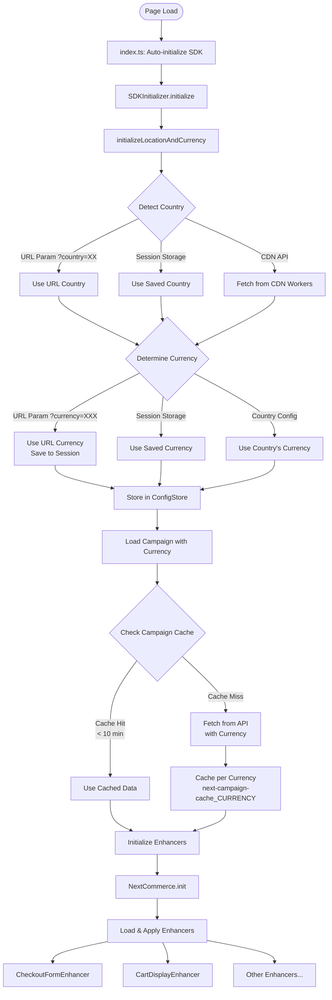
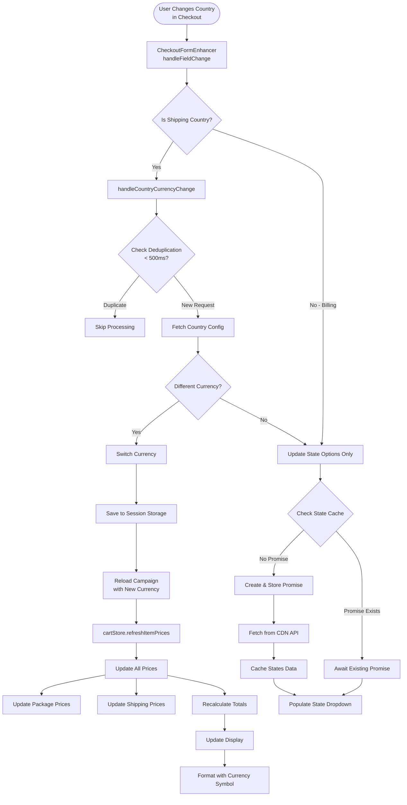
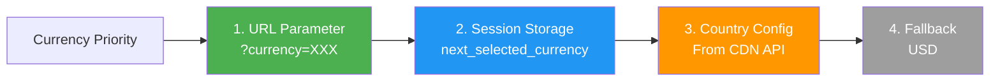
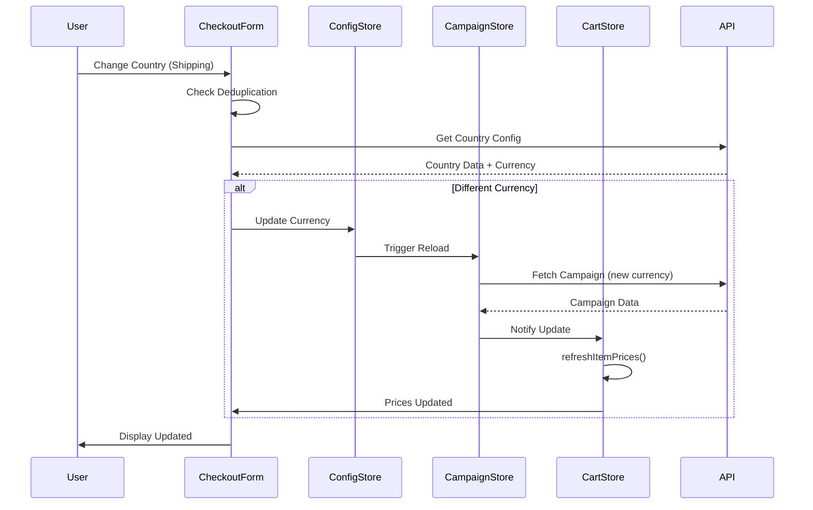
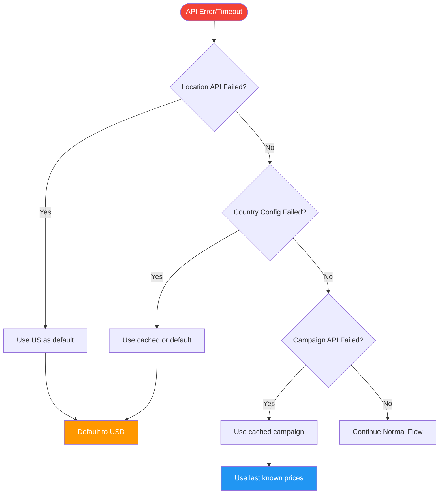

# Multi-Currency System Flow Chart

## System Architecture Flow



## Currency Change Flow (Checkout)



## Currency Detection Priority



## Data Flow & Caching

```mermaid
graph TB
    subgraph "Location Data"
        LocAPI[CDN Workers API<br/>location endpoint]
        LocCache[localStorage Cache<br/>1 hour TTL]
        LocAPI -.->|Cache| LocCache
    end
    
    subgraph "Country Config"
        CountryAPI[CDN Workers API<br/>countries/{code}/states]
        StateCache[sessionStorage Cache<br/>per country, 1 hour TTL]
        CountryAPI -.->|Cache| StateCache
    end
    
    subgraph "Campaign Data"
        CampaignAPI[NextCommerce API<br/>campaigns/?currency={code}]
        CampaignCache[sessionStorage Cache<br/>per currency, 10 min TTL]
        CampaignAPI -.->|Cache| CampaignCache
    end
    
    subgraph "Currency State"
        ConfigStore[ConfigStore<br/>Runtime State]
        SessionStore[sessionStorage<br/>next_selected_currency]
        ConfigStore <-.->|Sync| SessionStore
    end
    
    LocCache --> ConfigStore
    StateCache --> ConfigStore
    CampaignCache --> ConfigStore
```

## Component Interactions



## Error Handling & Fallbacks

